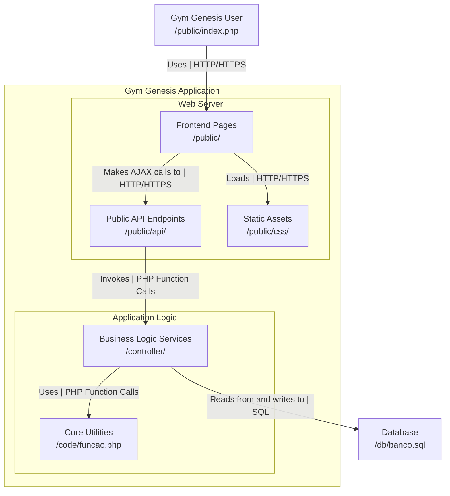

# Unnamed CodeViz Diagram

```mermaid
graph TD

    user["Gym Genesis User<br>/public/index.php"]
    database["Database<br>/db/banco.sql"]
    subgraph gym_genesis_app_boundary["Gym Genesis Application<br>[External]"]
        subgraph web_server_boundary["Web Server<br>[External]"]
            frontend_pages["Frontend Pages<br>/public/"]
            public_api["Public API Endpoints<br>/public/api/"]
            static_assets["Static Assets<br>/public/css/"]
            %% Edges at this level (grouped by source)
            frontend_pages["Frontend Pages<br>/public/"] -->|"Makes AJAX calls to | HTTP/HTTPS"| public_api["Public API Endpoints<br>/public/api/"]
            frontend_pages["Frontend Pages<br>/public/"] -->|"Loads | HTTP/HTTPS"| static_assets["Static Assets<br>/public/css/"]
        end
        subgraph application_logic_boundary["Application Logic<br>[External]"]
            business_logic_services["Business Logic Services<br>/controller/"]
            core_utilities["Core Utilities<br>/code/funcao.php"]
            %% Edges at this level (grouped by source)
            business_logic_services["Business Logic Services<br>/controller/"] -->|"Uses | PHP Function Calls"| core_utilities["Core Utilities<br>/code/funcao.php"]
        end
        %% Edges at this level (grouped by source)
        public_api["Public API Endpoints<br>/public/api/"] -->|"Invokes | PHP Function Calls"| business_logic_services["Business Logic Services<br>/controller/"]
    end
    %% Edges at this level (grouped by source)
    user["Gym Genesis User<br>/public/index.php"] -->|"Uses | HTTP/HTTPS"| frontend_pages["Frontend Pages<br>/public/"]
    business_logic_services["Business Logic Services<br>/controller/"] -->|"Reads from and writes to | SQL"| database["Database<br>/db/banco.sql"]

```
---
*Generated by [CodeViz.ai](https://codeviz.ai) on 01/10/2025, 19:47:17*
